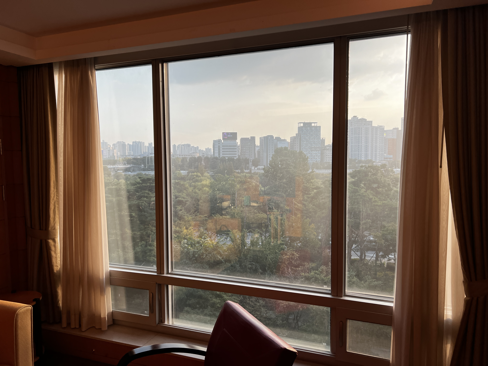

## 👋 안녕하세요.

눈여겨 보았던 Github, Gatsby를 이용한 블로그 만들기를 이제서라도 시작해 보았습니다.

아직 할 줄 아는 것은 몇가지 안되지만 이렇게 제공된 공간안에서 글을 쓰기부터 시작하려고 합니다.

최근에는 노션을 이용한 블로그가 유행인데요. 에디터와 실제 웹페이지 간의 구분이 없고 곧바로 고칠 수 있는 점은 굉장한 장점 입니다. 다만 아직까진 각주[^1]를 지원하지 않고 커스텀 폰트나 몇가지 스타일을 변경하려면 Oopy와 같은 별도 서비스를 이용하는 등 추가로 알아야할 것들이 많습니다.

물론 Gatsby를 이용한 블로그 보다는 비개발자로서 아주 직관적으로 쓸 수 있어서 좋습니다만 개발을 교양으로 배우려는 입장으로써는 도전할만한 가치가 있다 생각되어 Gatsby를 사용해보기로 했습니다.

[^1]: 이렇게 부연설명을 따로 적을 수 있는 기능. 소소하지만 써보고 싶었습니다.
